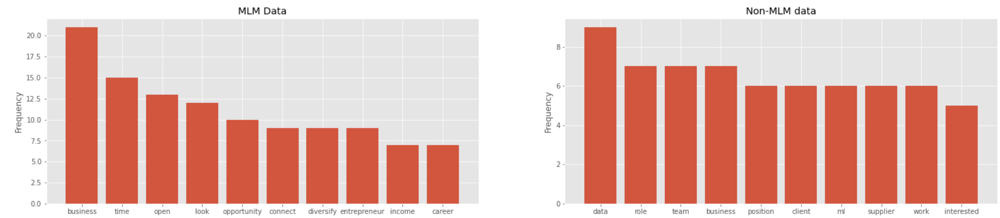
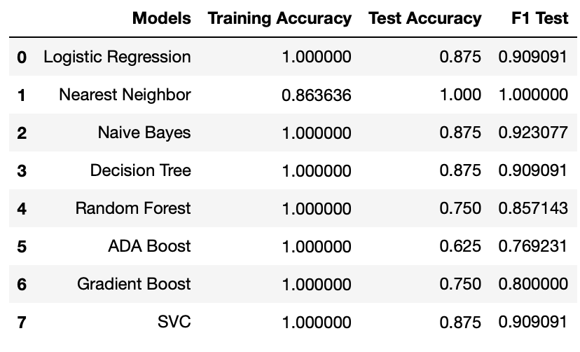

# Multi Level Marketing Message Recognizer (MLMMR)

The goal of this project is to research and measure the possibility of classifying messages into MLM recruiting vs regular recruiting.

## Data
Data was collected from my LinkedIn inbox. Due to privacy reasons, I will withold publishing the data until it can be pooled to the point that it cannot be recognized. There are 17 messages that are known MLM messages and 13 that are regular recruiting messages.

## EDA

The frequency chart shows top 10 words for each category. The MLM category shows the main ideas that are trying to be portrayed by MLM recruiting messages. Non-MLM messages are a bit more vague in what they are trying to portrayed, according to the frequency chart. From the 17 MLM messages, there was 171 unique words. From the 13 non-MLM messages, there as 400 unique words used.

## The Model

Models were compared to find the best one. None of the models were hypertuned. Naive Bayes was chosen because of its high F1 score. 

## Future Work
Lots more data is needed to improve the model, but its difficult to find it because most of the data is needed to be donated. Further analysis needs to be done in order to fully validate the conclusion.

## Conclusion
With the limited data gathered, it can be concluded that it is possible to effectively build a model that recognizes MLM recruiting messages. Furthermore, EDA findings point that MLM recruiting messages are very similar to eachother. The 171 unique words found in 17 MLM messages were substancially less than the 400 unique words found in 13 non-MLM messages.